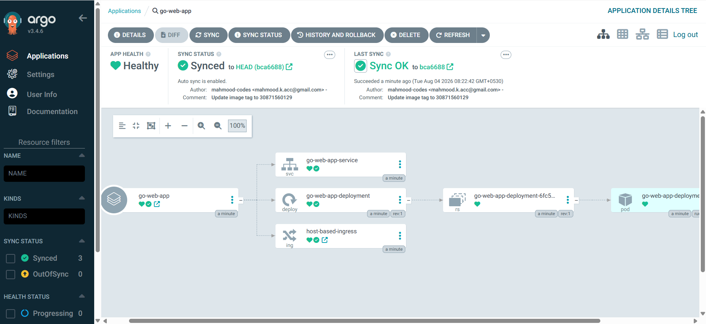

# 🚀 End-to-End GitOps CI/CD Pipeline on Amazon EKS

A production-inspired DevOps project demonstrating an automated CI/CD pipeline for a Go web application using **Docker, Kubernetes, Helm, GitHub Actions, Argo CD, and Amazon EKS**.

---

## 📌 Project Overview

This project demonstrates how modern DevOps practices can automate software delivery from source code commit to deployment on Kubernetes.

Every push to the `main` branch triggers a GitHub Actions pipeline that:

1. Builds the Go application
2. Runs unit tests
3. Performs static code analysis
4. Builds a Docker image
5. Pushes the image to Docker Hub
6. Updates the Helm chart with the new image tag
7. Commits the updated Helm chart back to GitHub

Argo CD continuously watches the Git repository and automatically synchronizes the latest version to Amazon EKS using **GitOps** principles.

---

## 🏗 Architecture

```
Developer
   │
   │ git push
   ▼
GitHub Repository
   │
   ▼
GitHub Actions (CI)
 ├── Build
 ├── Unit Tests
 ├── Static Code Analysis
 ├── Docker Build
 ├── Push Docker Image
 └── Update Helm values.yaml
   │
   ▼
GitHub Repository
   │
   ▼
Argo CD
   │
   ▼
Helm Deployment
   │
   ▼
Amazon EKS
   │
   ▼
Kubernetes Pods
   │
   ▼
Go Web Application
```

---

## 🛠 Tech Stack

| Category           | Technologies              |
|---------------------|----------------------------|
| Language            | Go                         |
| Containerization     | Docker                     |
| Container Registry   | Docker Hub                 |
| Orchestration        | Kubernetes                 |
| Cloud                | Amazon EKS                 |
| Package Manager      | Helm                       |
| CI                   | GitHub Actions             |
| CD / GitOps          | Argo CD                    |
| Ingress               | NGINX Ingress Controller   |
| Version Control       | Git & GitHub                |

---

## 📂 Repository Structure

```
go-web-app/
│
├── .github/
│   └── workflows/
│       └── ci.yaml
│
├── helm/
│   └── go-web-app-chart/
│       ├── Chart.yaml
│       ├── values.yaml
│       └── templates/
│
├── k8s/
│   ├── deployment.yaml
│   ├── service.yaml
│   └── ingress.yaml
│
├── Dockerfile
├── main.go
├── go.mod
└── README.md
```

---

## 🐳 Docker

The Go application is containerized using Docker.

**Workflow:** build application → create Docker image → push image to Docker Hub

```bash
docker build -t your-dockerhub-username/go-web-app:v1 .
docker push your-dockerhub-username/go-web-app:v1
```

---

## ☸ Kubernetes

Resources used:

- **Deployment** – manages application Pods
- **Service** – exposes the Pods internally
- **Ingress** – exposes the application externally using the NGINX Ingress Controller

---

## 📦 Helm

The application is deployed using Helm. The image is parameterized inside `values.yaml`:

```yaml
image:
  repository: your-dockerhub-username/go-web-app
  tag: "123456"
```

This allows GitHub Actions to update only the image tag after every successful build.

---

## ⚙ GitHub Actions CI Pipeline

1. Checkout source code
2. Build Go application
3. Run unit tests
4. Run `golangci-lint`
5. Login to Docker Hub
6. Build Docker image
7. Push image
8. Update Helm `values.yaml`
9. Commit updated tag back to GitHub

---

## 🔄 GitOps with Argo CD

Argo CD continuously monitors the Git repository. Whenever the Helm chart changes, it:

- Detects the new image tag
- Compares desired state with the cluster
- Synchronizes automatically
- Performs a rolling update

No manual `kubectl apply` is required.

---

## 🌐 Deployment Flow

```
Developer → git push → GitHub Actions → Docker Hub
   → Update Helm Chart → GitHub → Argo CD
   → Amazon EKS → Running Application
```

---

## 📸 Screenshots

| GitHub Actions | Docker Hub |
|---|---|
|  |  |

| Argo CD | Application |
|---|---|
|  |  |

---

## ▶ Running Locally

```bash
git clone https://github.com/mahmood-codes/go-web-app.git
cd go-web-app
docker build -t go-web-app .
docker run -p 8080:8080 go-web-app
```

---

## ☁ Deploy to Amazon EKS

```bash
kubectl apply -f k8s/
```

or with Helm:

```bash
helm install go-web-app ./helm/go-web-app-chart
```

---

## 🚀 CI/CD Workflow Summary

1. Developer pushes code
2. GitHub Actions runs
3. Go application builds
4. Tests execute
5. Linter validates code
6. Docker image created and pushed
7. Helm chart updated
8. Commit pushed automatically
9. Argo CD detects the Git change
10. Kubernetes performs a rolling deployment

---

## 📚 What I Learned

- Docker image lifecycle
- Kubernetes architecture (Deployments, Services, Ingress)
- Helm templating
- GitHub Actions pipelines
- Docker Hub integration
- GitOps principles
- Argo CD synchronization
- Amazon EKS deployment and rolling updates
- Troubleshooting Kubernetes networking
- Managing image tags automatically

---

## 🔧 Future Improvements

- [ ] Terraform for infrastructure provisioning
- [ ] Prometheus & Grafana monitoring
- [ ] Trivy image scanning
- [ ] SonarQube code analysis
- [ ] AWS Secrets Manager
- [ ] External Secrets Operator
- [ ] Argo Rollouts
- [ ] Multi-environment deployments
- [ ] Blue/Green deployments

---

## 👨‍💻 Author

**Mahmood Khan**
GitHub: [@mahmood-codes](https://github.com/mahmood-codes)

This project was built as a hands-on DevOps learning project to demonstrate modern CI/CD and GitOps practices using Amazon EKS.
