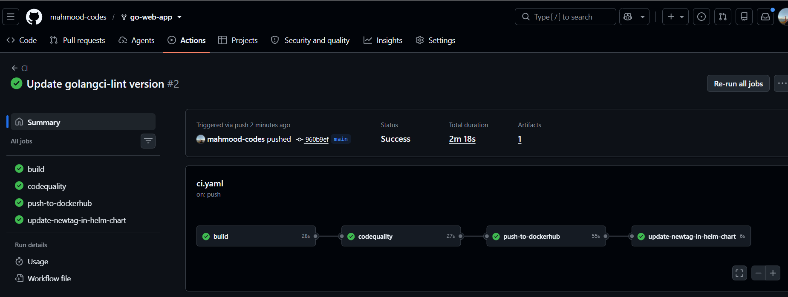
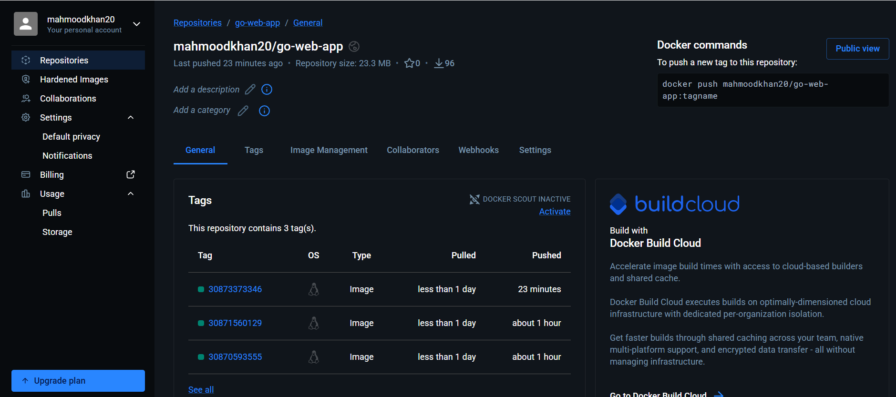
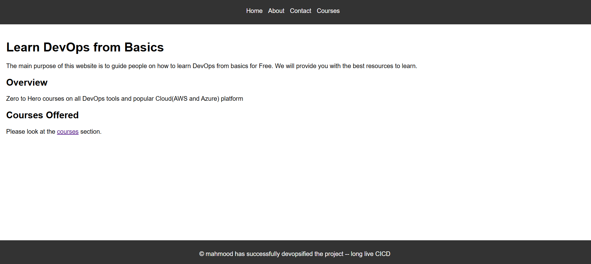

🚀 End-to-End GitOps CI/CD Pipeline on Amazon EKS

A production-inspired DevOps project demonstrating an automated CI/CD pipeline for a Go web application using Docker, Kubernetes, Helm, GitHub Actions, Argo CD and Amazon EKS.

📌 Project Overview

This project demonstrates how modern DevOps practices can automate software delivery from source code commit to deployment on Kubernetes.

Every push to the main branch triggers a GitHub Actions pipeline that:

Builds the Go application

Runs unit tests

Performs static code analysis

Builds a Docker image

Pushes the image to Docker Hub

Updates the Helm chart with the new image tag

Commits the updated Helm chart back to GitHub

Argo CD continuously watches the Git repository and automatically synchronizes the latest version to Amazon EKS using GitOps principles.

🏗 Architecture

Developer
    │
git push
    │
    ▼
GitHub Repository
    │
    ▼
GitHub Actions (CI)
 ├── Build
 ├── Unit Tests
 ├── Static Code Analysis
 ├── Docker Build
 ├── Push Docker Image
 └── Update Helm values.yaml
             │
             ▼
      GitHub Repository
             │
             ▼
          Argo CD
             │
             ▼
       Helm Deployment
             │
             ▼
         Amazon EKS
             │
             ▼
     Kubernetes Pods
             │
             ▼
      Go Web Application

🛠 Tech Stack

Category

Technologies

Language

Go

Containerization

Docker

Container Registry

Docker Hub

Orchestration

Kubernetes

Cloud

Amazon EKS

Package Manager

Helm

CI

GitHub Actions

CD

Argo CD

GitOps

Argo CD

Ingress

NGINX Ingress Controller

Version Control

Git & GitHub

📂 Repository Structure

go-web-app/
│
├── .github/
│   └── workflows/
│       └── ci.yaml
│
├── helm/
│   └── go-web-app-chart/
│       ├── Chart.yaml
│       ├── values.yaml
│       └── templates/
│
├── k8s/
│   ├── deployment.yaml
│   ├── service.yaml
│   └── ingress.yaml
│
├── Dockerfile
├── main.go
├── go.mod
└── README.md

🐳 Docker

The Go application is containerized using Docker.

Workflow:

Build application

Create Docker image

Push image to Docker Hub

Example:

docker build -t your-dockerhub-username/go-web-app:v1 .
docker push your-dockerhub-username/go-web-app:v1

☸ Kubernetes

Resources used:

Deployment

Service

Ingress

Deployment manages application Pods.

Service exposes the Pods internally.

Ingress exposes the application externally using the NGINX Ingress Controller.

📦 Helm

The application is deployed using Helm.

The image is parameterized inside values.yaml.

Example:

image:
  repository: your-dockerhub-username/go-web-app
  tag: "123456"

This allows GitHub Actions to update only the image tag after every successful build.

⚙ GitHub Actions CI Pipeline

Pipeline stages:

Checkout source code

Build Go application

Run unit tests

Run golangci-lint

Login to Docker Hub

Build Docker image

Push image

Update Helm values.yaml

Commit updated tag back to GitHub

🔄 GitOps with Argo CD

Argo CD continuously monitors the Git repository.

Whenever the Helm chart changes:

detects the new image tag

compares desired state with the cluster

synchronizes automatically

performs a rolling update

No manual kubectl apply is required.

🌐 Deployment Flow

Developer
      │
git push
      │
      ▼
GitHub Actions
      │
      ▼
Docker Hub
      │
      ▼
Update Helm Chart
      │
      ▼
GitHub
      │
      ▼
Argo CD
      │
      ▼
Amazon EKS
      │
      ▼
Running Application

📸 Screenshots

Add your screenshots here.

Suggested screenshots:

Repository

GitHub Actions successful run

Docker Hub image tags

EKS cluster

Kubernetes Pods

Kubernetes Services

NGINX Ingress

Helm chart

Argo CD Dashboard

Argo CD Sync Status

Running application

Example:

▶ Running Locally

git clone https://github.com/mahmood-codes/go-web-app.git

cd go-web-app

docker build -t go-web-app .

docker run -p 8080:8080 go-web-app

☁ Deploy to Amazon EKS

kubectl apply -f k8s/

or

helm install go-web-app ./helm/go-web-app-chart

🚀 CI/CD Workflow Summary

Developer pushes code

GitHub Actions runs

Go application builds

Tests execute

Linter validates code

Docker image created

Docker image pushed

Helm chart updated

Commit pushed automatically

Argo CD detects Git change

Kubernetes performs rolling deployment

📚 What I Learned

Docker image lifecycle

Kubernetes architecture

Deployments, Services and Ingress

Helm templating

GitHub Actions pipelines

Docker Hub integration

GitOps principles

Argo CD synchronization

Amazon EKS deployment

Rolling updates

Troubleshooting Kubernetes networking

Managing image tags automatically

🔧 Future Improvements

Terraform for infrastructure provisioning

Prometheus & Grafana monitoring

Trivy image scanning

SonarQube code analysis

AWS Secrets Manager

External Secrets Operator

Argo Rollouts

Multi-environment deployments

Blue/Green deployments

👨‍💻 Author

Mahmood Khan

GitHub: https://github.com/mahmood-codes

This project was built as a hands-on DevOps learning project to demonstrate modern CI/CD and GitOps practices using Amazon EKS.